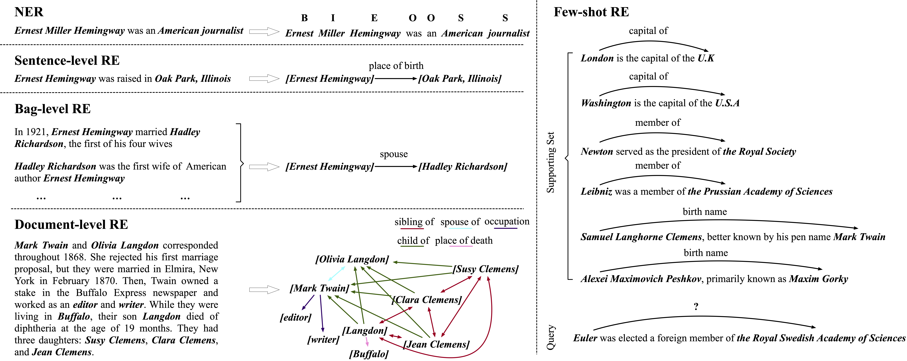

Settings and Benchmark
=============

There are many settings in relation extraction, targeting different challenges in this area. The following figure gives a vivid example of the formats of these settings.

Sentence-Level Relation Extraction
--------------------------------------

It is the most classical relation extraction task. Given a sentence and two tagged entities in the sentence, models neet to classify which relation these two entites have from a predefined relation set. 

Two commonly used datasets for sentence-level relation extraction are **SemEval 2010 Task-8** (`paper <https://www.aclweb.org/anthology/S10-1006.pdf>`_ / `website <http://semeval2.fbk.eu/semeval2.php?location=tasks#T11>`_) and **TACRED** (`paper <https://nlp.stanford.edu/pubs/zhang2017tacred.pdf>`_ / `website <https://nlp.stanford.edu/projects/tacred/>`_). We also provide a new dataset **Wiki80**, which is derived from **FewRel**.

The statistics of the three datasets are as follows:

====================  =======  ================================
Dataset               #class   #instance
====================  =======  ================================
SemEval-2010 Task 8   9         6,647
TACRED                42        21,784 (exclude *no_relation*)
Wiki80                80        56,000
====================  =======  ================================

.. NOTE:: Due to the copyright reason, we did not release the TACRED dataset. Please refer to the `official site <https://nlp.stanford.edu/projects/tacred/>`_ for details.

Bag-Level Relation Extraction
-------------------------------

This setting comes with **distant supervision**. Annotating large-scale relation extraction dataset is labor-intensive and money-consuming. On the other hand, there exist some knowledge graphs (KGs), like FreeBase and WikiData, already including relation triples. By linking entities mentioned in the text to these in the KGs, we can utilize the existing annotations in KGs to automatically label text, which is called distant supervision.

Though making large-scale training data available, distant supervision inevitably brings noise. For the denoising purpose, multi-instance multi-label setting was proposed. Instead of predicting relations for each sentence, in the multi-instance multi-label setting, models need to predict labels for each entity pair (which may have many sentences). Sentences share the same entity pair are called a "bag".

The most used dataset for distant supervision is **NYT10** (`paper <https://link.springer.com/content/pdf/10.1007%2F978-3-642-15939-8_10.pdf>`_ / `website <http://iesl.cs.umass.edu/riedel/ecml/>`_). We also provide **NYT10m** and **Wiki20m**, two distant supervised datasets with **manually** annotated test sets (paper: TBD).

====================  =======  =====================
Dataset               #class   #instance
====================  =======  =====================
NYT10                 53       694,491 
NYT10m                25       474,059
Wiki20m               81       901,314
====================  =======  =====================

Document-Level Relation Extraction
------------------------------------
You can refer to `DocRED <https://github.com/thunlp/DocRED>`_ for details.

Few-Shot Relation Extraction
------------------------------
Inspired by the facts that human can grasp new knowledge with only a handful of training instances, few-shot learning was proposed to explore how models can fast adapt to new tasks. **FewRel** is a large-scale few-shot relation dataset (`paper <https://www.aclweb.org/anthology/D18-1514.pdf>`_ / `website <https://github.com/thunlp/FewRel>`_). The way to sample data and evaluate models in the few-shot setting is quite different from others, and you can refer to the `paper <https://www.aclweb.org/anthology/D18-1514.pdf>`_ for details. Statistics of the dataset are shown in the following table:

====================  =======  =====================
Dataset               #class   #instance
====================  =======  =====================
FewRel                100      70,000
====================  =======  =====================

